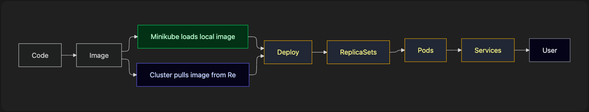

This blog documents a **practical Kubernetes workflow** for deploying a containerized `FastAPI` application using `Docker`, `Minikube` and `kubectl`.  This is a developer-first workflow, optimized for local development and experimentation for beginners.

> Github Repository: [fastapi-k8s-orchestration](https://github.com/arpon-kapuria/fastapi-k8s-orchestration)

## Start Docker

Docker must be running before anything else.

#### Why?

- Minikube uses Docker as its runtime (on most systems)
- Docker builds and stores container images
- Kubernetes ultimately runs containers, not source code

## Build the Docker Image

#### Why?

- Everything must be packaged as an image
- Kubernetes cannot run source code directly

```bash
# [docker build -t IMAGE_NAME .]

docker build -t fastapi-k8s-orchestration .
```

#### What this does -

- Builds a container image from the `Dockerfile`
- Tags it as `fastapi-k8s-orchestration:latest`

## Test the Image Locally

#### Why?

- Verifies the image works before Kubernetes
- Saves debugging time later

```bash
# [docker run -it --rm -p [port:port] [IMAGE_NAME]]
# Run the container (the --rm flag deletes the container automatically after it stops)

docker run -it --rm -p 9696:9696 fastapi-k8s-orchestration
```

#### What this does -

- Runs the container locally
- Maps container port → host port
- Removes the container after exit

## Push Image to Docker Hub (Optional)

This is required if Kubernetes needs to pull the image from a registry.

### 4.1 Tag the Image

- Docker Hub requires images in the format: `username/repository:tag`
- Tagging does not create a copy; it creates a new reference

```bash
# [docker tag SOURCE_IMAGE[:TAG] TARGET_IMAGE[:TAG]]

docker tag fastapi-k8s-orchestration:latest \
aaaaarrp/fastapi-k8s-orchestration:latest
```

### 4.2 Push the Image

- Makes the image available to Kubernetes nodes
- Required for cloud clusters (EKS, GKE, etc.)

```bash
# [docker push USERNAME/REPOSITORY[:TAG]]

docker push aaaaarrp/fastapi-k8s-orchestration:latest
```

## Minikube — Local Kubernetes Cluster

Minikube runs a *single-node (or multi-node) Kubernetes cluster locally*, inside Docker. 

#### Why?

- Lightweight
- No cloud cost
- Perfect for learning and testing

#### Useful Minikube Commands

```bash
# Start the Cluster
minikube start

# Check Status 
minikube status

# Stop the Cluster
minikube stop

# Delete the Cluster
minikube delete --all

# Exposes a Kubernetes Service to your browser
minikube service <app_name>

# Launches the Kubernetes UI (In real systems, Prometheus + Grafana are preferred)
minikube dashboard

# Lists images available inside the cluster
minikube image list

# Deletes a preloaded image. (Good practice is to load next version)
minikube image rm <image_name>

# Add More Nodes
minikube start --nodes=2
```

## Kubernetes Control Tool (kubectl)

`kubectl` is the **CLI client** used to interact with the Kubernetes API. Kubernetes itself is an API-driven system. 

`kubectl` is how you talk to it.

#### Why?

- Understand cluster state
- Debug deployments
- Verify networking

#### Common Inspection Commands

```bash
# List all Kubernetes resources across all namespaces
kubectl get all -A

# List all pods across all namespaces
kubectl get pods -A

# List all cluster nodes
kubectl get nodes -A

# List all services in the current namespace
kubectl get services

# List all endpoints in the current namespace
kubectl get endpoints
```

## Getting Images Into the Cluster

#### Option 1: Load Local Image Directly

```bash
minikube image load fastapi-k8s-orchestration:latest

# Fast iteration
# No registry required
# Best for local development
```

#### Option 2: Pull from Docker Hub

```bash
Image → Docker Hub → Cluster

# Simulates production workflow
# Required for cloud Kubernetes
```

#### Option 3: Pull from Cloud Registry (e.g., AWS ECR)

```bash
Image → ECR → Cluster

# Secure, private images
# Used in real production systems
```

## Kubernetes Manifests

#### Create:

- `deployment.yaml`
- `service.yaml`

*(They can also be combined into one file)*

#### Important:

- Container ports must match:
    - Dockerfile
    - Deployment
    - Service

## Deploy the Application

#### What happens?

> Deployment → ReplicaSet → Pods
> 

#### Why?

- Deployment manages rollout and scaling
- ReplicaSet ensures desired pod count
- Pods run containers

```bash
kubectl apply -f k8s/

# `deployment.yaml` and `service.yaml` files are in k8s folder
```

## Access the Application

Minikube exposes the service using a local tunnel or NodePort.

```bash
# minikube service <app_name>

minikube service kubernetes-test-app
```

#### Load Balancing & Logs

```bash
# check running pods
kubectl get pods

# stream logs
kubectl logs -f <pod-id/name>
```

#### Using Postman

`Collection → Runs → Performance → Run Performance Test → Performance → (Fixed → 10users → 1min) → Run`

## Final Step: Stop/Delete Resources

```bash
# stop the cluster
minikube stop

# delete Deployment (Image Remains)
kubectl delete deployment <app_name>

# delete Service
kubectl delete service <service_name>

# delete a pod
kubectl delete pod <pod-name>

# delete a replica set
kubectl delete rs <replicaset-name>
```

## Mental Model Summary



<hr>

> This workflow mirrors how **real Kubernetes systems are built**, just at a smaller scale. Once comfortable with this flow, moving to **EKS / GKE / AKS** becomes straightforward.