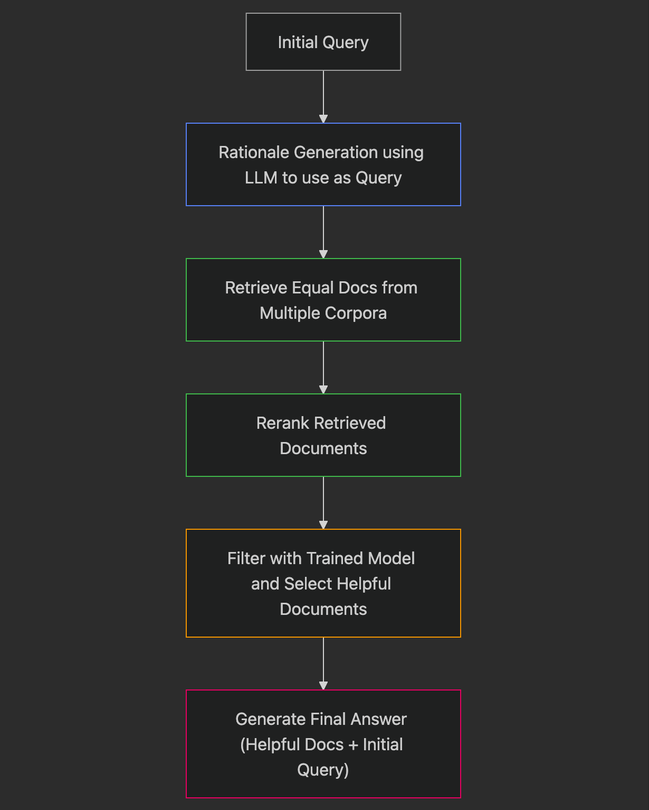

## Background

The authors address the challenge of **hallucination**, **outdated knowledge** and **irrelevant retrieval** in medical QA systems powered by large language models (LLMs). While RAG frameworks offer some mitigation, they remain limited by:

- Poor initial queries for retrieval,
- Irrelevant or noisy retrieved contexts,
- Biases in biomedical corpora,
- Lack of integration between rationale reasoning and retrieval.

## Methodology

Their proposed solution **RAG²** enhances standard RAG via three key modules:

1. **Rationale Based Query Formulation:**
    - An LLM is prompted **(Chain-of-Thought)** to generate a rationale for a medical question.
    - This rationale is then used as a more focused query for retrieval.
2. **Balanced Retrieval:**
    - Documents are retrieved equally from multiple biomedical corpora to reduce source bias.
    - Then the retrieved documents are reranked using a medical domain focused reranker **(MedCPT)** to sort documents that are more closely aligned with the query.
3. **Lightweight Filtering model**:
    - A lightweight classifier **(Flan-T5-large)** trained on snippet rationales scored by perplexity score.
    - During the training of Filtering model, authors introduced a threshold value, while constructing the dataset, for precise labelling as perplexity can not be enough for accuracy.
    - Then filters retrieved snippets to retain only informative ones.

## Workflow

## Evaluation

- Evaluated on multiple biomedical QA datasets.
- RAG² achieves **5.6–6.1% absolute gains** over standard LLM baselines.
- Performance tends to increase as the top-k value increases with some exception with the limitations of the context length of an LLM.
- Rationales generated from higher performing models (eg. chatGPT) yields the highest performance improvements.
- Shows rationale queries can be effective with smaller open source models as well.

## References

- [Rationale-Guided Retrieval Augmented Generation for Medical Question Answering](https://aclanthology.org/2025.naacl-long.635/) (Sohn et al., NAACL 2025)