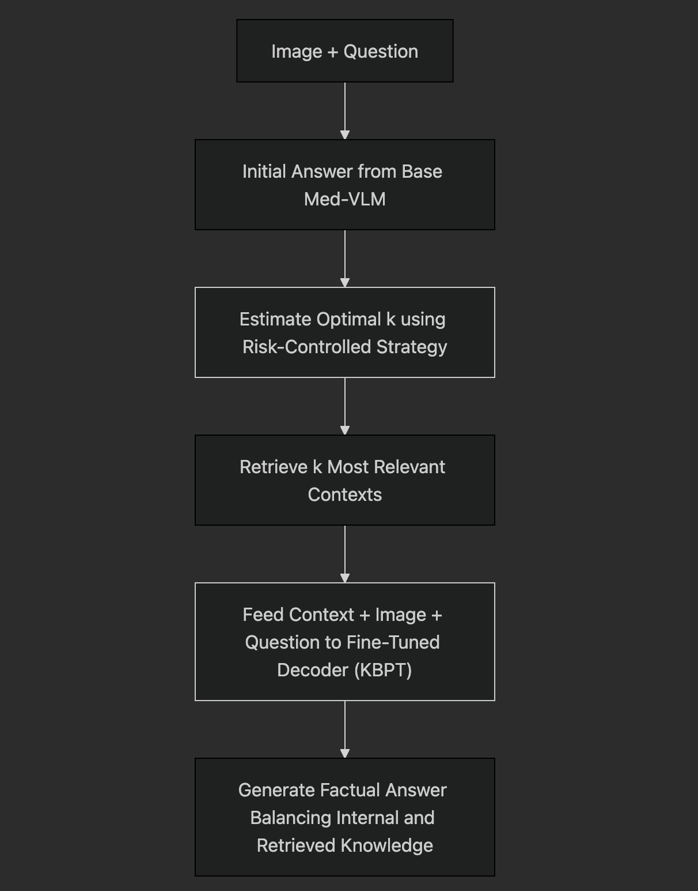
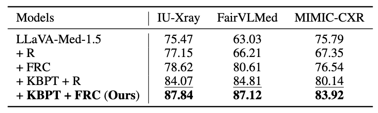

## Background

The paper targets factual inconsistency in **medical large vision-language models (Med-LVLMs)** enhanced with **retrieval-augmented generation (RAG)**. While RAG improves factual grounding, it introduces two major issues:

- **Under and Over-retrieval Tradeoff**:
    - Retrieving too little evidence risks missing essential context.
    - Retrieving too much introduces irrelevant or noisy information, increasing hallucinations.
- **Over-reliance on Retrieved Evidence**:
    - The model may override correct internal knowledge due to misleading retrieved contexts.
    - Existing Med-VLMs lack mechanisms to balance trust between their learned parameters and retrieved inputs.

## Methodology

The proposed system, **RULE**, tackles these two problems through:

1. **Factuality Risk-Controlled Retrieval**
    - Introduces a retrieval strategy that dynamically calibrates the number of retrieved documents (`k`) to minimize the risk of factual inconsistency.
    - This avoids the need to predefine a static `k` for all queries.
2. **Knowledge-Balanced Preference Tuning (KBPT)**
    - Constructs a **preference dataset** where over-reliance on retrieved evidence leads to incorrect answers.
    - Uses these instances to fine-tune the Med-VLM so it learns when to trust its own knowledge vs. when to rely on retrieved content.
    - This tuning is done with pairwise ranking: the model is shown both correct and incorrect answers (with and without retrieval) and learns to prefer factual ones.

## Workflow

## Evaluation

1. **Datasets Used**:
    - **MIMIC-CXR**, **IU-Xray**, and **Harvard-FairVLMed** – covering radiology and ophthalmology.
2. **Metrics Used:**
    - For Med-VQA task, Accuracy is used as the primary metric and Precision, Recall and F1 score are used for detailed comparison.
    - For Report Generation task, ROUGE-L, METEOR and BLEU scores are used.
3. **Main Results**:
    - **RULE** demonstrates average accuracy improvement of **47.4%** compared to both the baseline model and other Med-LVLMs.
    - **RULE** performed better on **IU-Xray** and **Harvard-FairVLMed**. According to the authors, the reason behind the difference is that the **excessive length of the reports** available in MIMIC-CXR tend to confuse the model.
4. **Compatibility Analysis:**
    - Authors have used a compatibility check as well with **LLaVA-Med-1.0**, where they have found an accuracy increment of 16.7%.
5. **Ablation Studies**:
    - Removing certain models result in factual accuracy drop.
        

        

## References

- [RULE: Reliable Multimodal RAG for Factuality in Medical Vision Language Models](https://aclanthology.org/2024.emnlp-main.62/) (Xia et al., EMNLP 2024)