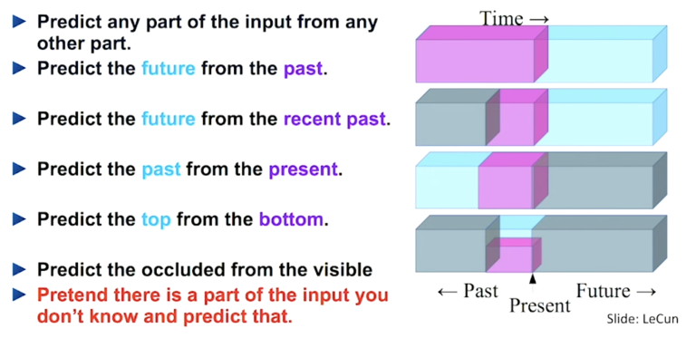

**T**he self-supervised learning approach can be described as the machine predicts any part of the input from any observed part. It's like *Filling in the Blanks*.

Here, the model trains itself to learn one part of the input from another part of the input. The process of the self-supervised learning method is to identify any hidden part of the input from any unhidden part of the input.

## Why do we need SSL?

Supervised learning is trained over a specific task with a large manually labeled dataset which is randomly divided into training, validation, and test sets. Therefore, the success of a good machine learning model relies on the availability of a large amount of annotated data which is time-consuming and expensive to acquire. So, the cost of high-quality annotated data is a major bottleneck in the overall training process.

It requires less labeled data and enables learning from unlabelled data. Although it can require more computations and may not perform as well as Supervised Learning on some specific tasks.

> **Differences between Unsupervised Learning and Self Supervise Learning ?**
> 
> Unsupervised learning focuses on detecting specific data patterns (such as clustering, community discovery, or anomaly detection), while self-supervised learning aims at recovering missing parts, which is still in the paradigm of supervised settings.

## Auto-encoders
    
Auto encoders are neural networks which can learn to compress and reconstruct input, such as images, using a hidden layer of neurons. It consists of two parts -

1. **Decoder** - reconstructs the input data from the latent space representation.
2. **Encoder** - takes the input data and compresses it into a lower-dimensional representation called the latent space.

#### Popular models 
- *Regular Autoencoding models:* Encode data into a lower dimensional latent space, then decoder reconstruct the original input.
- *Contractive Autoencoders:* Adds a regularization term
- *Convolutional Autoencoders:* Learns a compressed representation of an image by minimizing the reconstruction error
- *Sparse Autoencoders:* Produces less encoding vectors to identify important features of the input.
- *Denoising Autoencoders:* Adds noise to input > Creates corrupted input > Trains the model to reconstruct the original input
- *Variational Autoencoders:* Trained to learn a mapping from the input data to a probability distribution in a lower-dimensional latent space, and then to generate new samples from this distribution.
- *Masked Autoencoders:* Masked few parts of the input and then train the model to recover those masked parts. (Point MAE important for SSL)
  
## Contrastive Learning
    
In Contrastive learning, we try to teach a model the similarities and differences between unlabelled data points by contrasting them against each other. Those belonging to the same distribution are pushed towards each other in the embedding space. In contrast, those belonging to different distributions are pulled against each other. It uses positive and negative sample to samples to guide the model. Maximises the distance between negative samples(different pictures) and minimises the distance between positive samples(same pictures).

### MoCo (2020)
   
MoCo is short for momentum contrast, which is a method for updating network parameters during training using large scale unlabelled datasets. 

Three versions of this technique have been published so far.

> **MoCo v1**
>
> It uses two encoders, an encoder and a momentum encoder which maintains a moving average of the model's weights. A query image is processed by the encoder network to compute q, the encoded query image. To differentiate between a large number of images, the query image encoding is compared not only to one mini-batch of encoded key images, but to multiple of them. MoCo creates a queue of mini-batches encoded by the momentum encoder network. As a new mini-batch is selected, its encodings are added to the queue and the oldest encodings are removed. This allows for a larger dictionary size, independent of the batch size, to query from. If the query image encoding matches a key in the dictionary, the two views are considered to be from the same image (e.g., different crops).

> **MoCo v2**
> 
> It focused on reducing the computational and memory requirements of MoCo v1. It introduced a memory bank to store and update negative examples, which reduced the need for large-scale mini-batches. Initially, for training a linear classifier after pre-training MoCo, they added a single linear layer to the model. In MoCo v2, this layer has been replaced by an MLP projection head, leading to better classification performance. They extend the v1 augmentations by adding blur and stronger colour distortion.

> **MoCo v3**
> 
> It takes a step further by investigating the training dynamics and various design choices in MoCo v1 and MoCo v2. One of the key enhancements in MoCo v3 is the introduction of stronger data augmentations. They propose two new augmentation techniques, namely SwAV and PIRL, and show that incorporating these methods improves the performance of MoCo. Additionally, MoCo v3 investigates the effect of different design choices, such as the size of the memory bank and the number of negative examples used for contrastive learning.
      
### SimCLR (2020)
      
Its basic working principle is to maximise the agreement between different augmented versions of the same sample using a contrastive loss in the latent space. Large batch sizes used here and TPUs to generate sufficient number of negative pairs.

The SimCLR model consists of the following modules:

1. Data Augmentation module
2. Encoder
3. Projection Head
4. Contrastive loss function

      
### BYOL (2020)
      
BYOL short for Bootstrap Your Own Latent. Unlike other contrastive methods, it doesn’t use negative pairs. Instead, it uses two networks that learn from each other to iteratively bootstrap the representations by forcing one network(online) to use an augmented view of an image to predict the output of the other network(target) for a different augmented view of the same image.

      
### SwAV (2021)
      
SwAV is a self-supervised learning algorithm that begins with input images and applies multi-crop augmentations to generate multiple views. These views are processed by a network, resulting in feature vectors that capture image representations. The algorithm then learns prototype vectors, which represent cluster centres. Assigning clusters is achieved by predicting assignment vectors for each view, indicating the probability of belonging to each prototype. To refine the assignments, a swapping process is employed to align and enhance the consistency of cluster assignments across different views of the same image. Finally, the network leverages the feature vectors and refined assignments to predict and learn meaningful visual representations

      
### Barlow Twins (2021)
      
Here the visual representation learning is done by introducing a new objective function that naturally avoids collapse by calculating the cross correlation matrix between the outputs of two identical networks fed with the distorted views of a sample, and making it as close to the identity matrix as possible. This causes the embedding vectors of distorted views of a sample to be close while minimising the redundancy between the components of these vectors.

      
### NNCLR (2021)
      
While most methods treat different views of the same image as positives for a contrastive loss, Nearest-Neighbour Contrastive Learning (NNCLR) tries to use the positives from other instances in the dataset, i.e., uses different images from the same class, rather than augmenting the same image.

## Evaluation

#### Performance metrics

1. Top-k Accuracy
2. Transfer Learning performance (Fine tuning)
3. Computational efficiency (training time, memory usage)
   
#### Linear evaluation on ImageNet
    
| Algorithm | Backbone | Epoch | Batch size | (Top-1%) |
| --- | --- | --- | --- | --- |
| MoCo v2 | ResNet50 | 200 | 256 | 67.5 |
| MoCo v3 | ResNet50 | 100 | 4096 | 69.6 |
| MoCo v3 | ResNet50 | 300 | 4096 | 72.8 |
| MoCo v3 | ResNet50 | 800 | 4096 | 74.4 |
| simCLR | ResNet50 | 200 | 256 | 62.7 |
| simCLR | ResNet50 | 200 | 4096 | 66.9 |
| simCLR | ResNet50 | 800 | 4096 | 69.2 |
| BYOL | ResNet50 | 200 | 4096 | 71.8 |
| Barlow Twins | ResNet50 | 300 | 2048 | 71.8 |
| SwAV | ResNet50 | 200 | 256 | 70.5 |

*References*

1. [https://mmselfsup.readthedocs.io/en/latest/model_zoo_statistics.html](https://mmselfsup.readthedocs.io/en/latest/model_zoo_statistics.html)
2. [https://github.com/open-mmlab/mmselfsup](https://github.com/open-mmlab/mmselfsup)

## Extra Resources

- [https://ai.facebook.com/blog/self-supervised-learning-the-dark-matter-of-intelligence/](https://ai.facebook.com/blog/self-supervised-learning-the-dark-matter-of-intelligence/)
- [https://atcold.github.io/pytorch-Deep-Learning/en/week07/07/](https://atcold.github.io/pytorch-Deep-Learning/en/week07/07/)
- [Cookbook of Self Supervised Learning](https://arxiv.org/pdf/2304.12210.pdf)
- [lilianweng.github.io/posts/-self-supervised/](https://lilianweng.github.io/posts/2019-11-10-self-supervised/)
- [https://neptune.ai/blog/self-supervised-learning](https://neptune.ai/blog/self-supervised-learning)
- Papers - [https://github.com/jason718/awesome-self-supervised-learning](https://github.com/jason718/awesome-self-supervised-learning)
- Papers - [https://github.com/wvangansbeke/Self-Supervised-Learning-Overview](https://github.com/wvangansbeke/Self-Supervised-Learning-Overview)